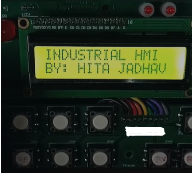
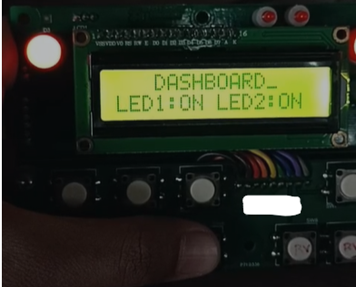

# STM32_LCD_MENU_SYSTEM
Designed and developed an STM32-based LCD menu system with hierarchical navigation, real-time user interaction through push-button controls, and embedded firmware using Embedded C and the STM32 HAL library.
> **Note:** This project was developed on a company-provided STM32 development board. This repository contains only the firmware and documentation developed by me. Company-specific hardware details and identifiers have been omitted.

## Hardware Used

| Component | Description |
|-----------|-------------|
| Microcontroller | STM32 Microcontroller |
| Display | 16×2 Character LCD |
| Input | 6 Push Buttons |
| Development Environment | STM32CubeIDE |
| Firmware Library | STM32 HAL |
| Language | Embedded C |

---

## Button Functions

| Button | Function |
|---------|----------|
| SW1 | Open Menu / Back |
| SW2 | Move Cursor Left |
| SW3 | Navigate Up |
| SW4 | Navigate Down |
| SW5 | Enter / Select |
| SW6 | Move Cursor Right |

---

## Menu Structure

```
Main Menu
│
├── GPIO Test
│   ├── LED1
│   └── LED2
│
├── PWM Control
│   ├── Duty Cycle
│   └── Frequency
│
├── ADC Monitor
│
├── UART Test
│
├── RTC Clock
│
└── Settings
```
## Demo

### LCD Home Screen



---

### Menu Navigation


---
### Dashboard



---

### Project Demonstration

A complete demonstration of the project is available in the repository.

**File:** `LCD_Display_DEMO.mp4`
